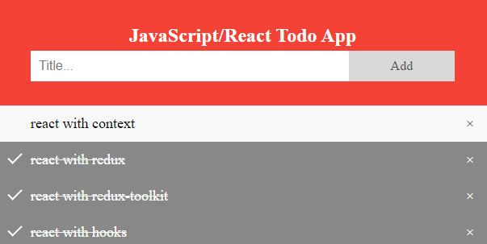
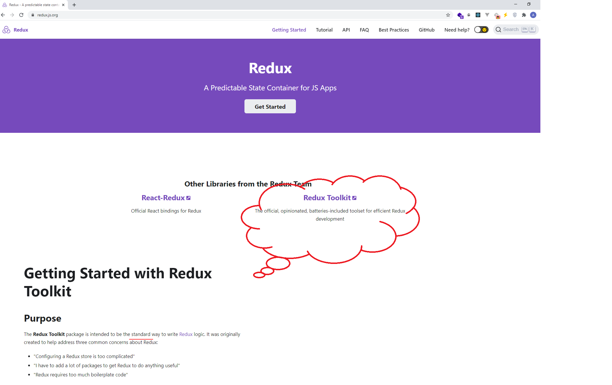

# TODO App using Javascrit React Redux Redux-Toolkit

In this Repo I'm trying to make a good comparison between different approaches of developing react app
in a simple todo-app. It may be overkill to use redux for such very simple app, but I've used this app because it can be simplified to write and read about different approaches.

**Note about** `Redux-Toolkit`:

The Redux Toolkit package is intended to be the `standard` way to write `Redux logic`. It was originally created to help address three common concerns about Redux:

- "Configuring a Redux store is too complicated"
- "I have to add a lot of packages to get Redux to do anything useful"
- "Redux requires too much boilerplate code"

### What's Included

Redux Toolkit includes these APIs:

- `configureStore()`: wraps createStore to provide simplified configuration options and good defaults. It can automatically combine your slice reducers, adds whatever Redux middleware you supply, includes `redux-thunk` by default, and enables use of the Redux DevTools Extension.
- `createReducer()`: that lets you supply a lookup table of action types to case reducer functions, rather than writing switch statements. In addition, it automatically uses the `immer` library to let you write simpler immutable updates with normal mutative code, like state.`todos[3].completed = true`.
- `createAction()`: generates an action creator function for the given action type string. The function itself has `toString()` defined, so that it can be used in place of the type constant.
- `createSlice()`: accepts an object of reducer functions, a slice name, and an initial state value, and automatically generates a slice reducer with corresponding action creators and action types.
- `createAsyncThunk`: accepts an action type string and a function that returns a promise, and generates a `thunk` that dispatches `pending/fulfilled/rejected` action types based on that promise
- `createEntityAdapter`: generates a set of reusable reducers and selectors to manage normalized data in the store
- The `createSelector` utility from the Reselect library, re-exported for ease of use.

[official CodePen Redux-toolkit Counter example](https://codesandbox.io/s/github/reduxjs/redux-essentials-counter-example/tree/master/?from-embed)

##### References

[Reference to Redux-toolkit](https://redux-toolkit.js.org/introduction/getting-started)

[Reference to w3schools TodoList template](https://www.w3schools.com/howto/howto_js_todolist.asp)

**Enjoy!** `Like & ReShare🌹😘`
